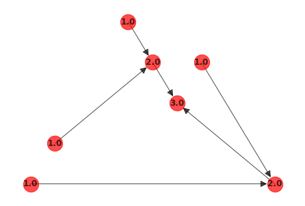
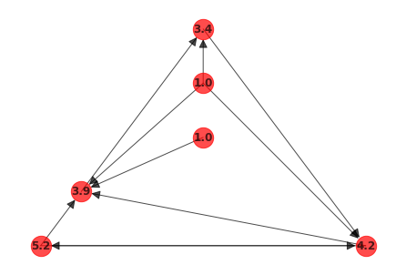

# python-TrophicCoherence
A Python library to compute trophic coherence in directed graphs

Example:

import networkx as nx
import TrophicCoherence

G = nx.DiGraph()

G.add_edges_from([(1, 10), (2, 10), (3, 20), (4, 20), (10, 100), (20, 100)])

_, G = TrophicCoherence.compute_trophic_levels(G)

nx.draw_planar(G, with_labels=True, node_color="r", alpha = 0.7, arrowsize=20,
               node_size=500, font_weight="bold")
               

coherence = TrophicCoherence.coherence_parameter(G, TrophicCoherence.trophic_diff(G))

print("Coherence of the network: ", coherence)

Coherence of the network: 0.0

G = nx.DiGraph()

G.add_edges_from([(1, 100), (20, 10), (3, 20), (4, 10), (4, 20), (10, 100), (4, 100), (100,20), (100,1), (1,20)])

_, G = TrophicCoherence.compute_trophic_levels(G)

nx.draw_planar(G, with_labels=True, node_color="r", alpha = 0.7, arrowsize=20,
               node_size=500, font_weight="bold")

coherence = TrophicCoherence.coherence_parameter(G, TrophicCoherence.trophic_diff(G))

print("Coherence of the network: ", coherence)

Coherence of the network: 1.65
